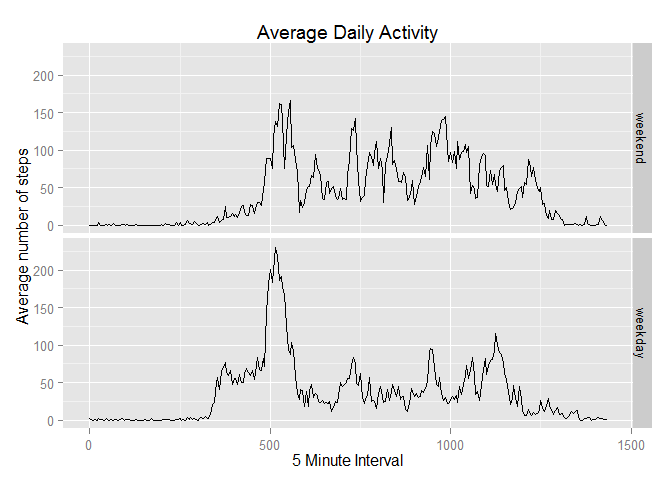

# Reproducible Research: Peer Assessment 1
Lee Mendoza


```r
## load the necessary libraries
library(plyr)
library(ggplot2)
library(reshape2)
```

###Loading and preprocessing the data

```r
## Load and preprocess the data - assumes that the data are 
## uncompressed and in the current active folder
data = read.table("activity.csv", header=TRUE, sep=",")
## convert the variable 'interval' from an integer to a factor
data$interval = as.factor(data$interval)
```
***

###What is mean total number of steps taken per day?

```r
## get the sum of steps for each day
steps_each_day = ddply(data, ~date, summarize, Total = sum(steps))
## use the steps_each_day data to create a histogram
hist(steps_each_day$Total, ylim = c(0, 12), breaks=40, main="Total Steps Per Day", xlab = "Steps Per Day", ylab = "Count")
```

 

#####The mean number of steps per day is 10766.19, and the median number of steps per day is 10765
***

### What is the average daily activity pattern?

```r
## Since we're going to make a time-series plot, we'll create a function to
## convert the HM formatted intervals to only minutes. This gives us a 
## scale with equal intervals between the factors, rather than something
## like 50, 55, 100, 105... and 1550, 1555, 1600, 1605..., etc
tminutes = function(x){
    ## minutes = last two characters
    minutes = as.integer(substr(x, nchar(x)-1, nchar(x)))
    ## hrs = everything except the last two characters; if there's only
    ## two characters, then hrs = 0
    hrs = ifelse(nchar(x) > 2, as.integer(substr(x, 1, nchar(x)-2)), 0)
    thevalue = (60 * hrs) + minutes
    ## return
    thevalue
}

## calculate average steps per interval, across days
act_pattern = ddply(data, ~interval, summarise, meansteps = mean(steps, na.rm = TRUE))
## convert the 'interval' into a more usable value for plotting the time series
act_pattern$minutes = tminutes(as.character(act_pattern$interval))
## Make a time series plot of the minutes since midnight and the 
## average number of steps taken, averaged across all days
ggplot(data=act_pattern, aes(x = minutes, y = meansteps)) + 
    geom_line() +
    labs(title = "Average Daily Activity", x = "Minutes since midnight", y = "Average number of steps")
```

 


#### Which 5-minute interval, on average across all the days in the dataset, contains the maximum number of steps?

```r
## order the activity pattern by mean steps (descending)
ordered = act_pattern[order(-act_pattern$meansteps),]
## take the top row as the maximum
max_interval = as.integer(as.character(ordered[1,"interval"]))
```
#####The interval with the maximum number of steps across all days is interval 835
***


### Imputing missing values
#### How many missing values are in the data set?

```r
# Calculate and report the total number of missing values in the dataset 
miss = sum(is.na(data$steps))
```
#####There are 2304 missing values in the original data set  


#### For any missing values in the original data set, we'll insert the average daily value at that interval

```r
## first, get all the rows where 'steps' is NA
missing = data[which(is.na(data$steps)),]
## now merge this data set with the act_pattern data set by 'interval'.  The act_pattern
## data set has the average values for each interval. 'meansteps' will be added to each
## interval in the resulting data set.
notna = merge(act_pattern, missing, by="interval")

## now merge this data set with the original data, which is riddled with NA.
## merge based on 'interval', 'steps', and 'date'. The meansteps column will be 
## added to the resulting data set. I used 'steps' as a joining factor so that the 
## 'meansteps' value will only be added to rows in which is.na(steps) is true.
## 'all.y' will insert NAs in the "meansteps' in rows where the is.na(steps) is false
all = merge(notna, data, by=c("interval", "steps", "date"), all.y = TRUE)

# finally, if 'steps' == NA, then replace NA with the 'meansteps' value
all$steps = ifelse(is.na(all$steps), all$meansteps, all$steps)
## to create a data set identical to the original but with imputed values
## remove extra column
all$meansteps = NULL
## and use original column order 
all = all[c("steps", "date", "interval")]
```


####Make a histogram of the total number of steps taken each day and calculate and report the mean and median total number of steps taken per day. Do these values differ from the estimates from the first part of the assignment? What is the impact of imputing missing data on the estimates of the total daily number of steps?

```r
## get the sum of steps for each day
steps_each_day = ddply(all, ~date, summarize, Total = sum(steps))
## use the steps_each_day data to create a histogram
hist(steps_each_day$Total, ylim = c(0, 12), breaks=40, main="Total Steps Per Day", xlab = "Steps Per Day", ylab = "Count")
```

 

The mean number of steps per day is 10766.19, and the median number of steps per day is 10766.19.  Compared to the data with missing values, we see that the mean estimate is equal with and without missing values, and the median value has increased only slightly in the data set with imputed values. The main difference is in the height of the distribution, with the imputed data set having more values near the mean than the data set with missing values.


---
## Are there differences in activity patterns between weekdays and weekends?

```r
## let's create a weekday function
weekdayorweekend = function(x){
    ## get the day of the week the date corresponds to
    theday = weekdays(x)
    ## convert the day to either weekend or weekday
    theday[theday == "Saturday"] = "weekend"
    theday[theday == "Sunday"] = "weekend"
    theday[theday == "Monday"] = "weekday"
    theday[theday == "Tuesday"] = "weekday"
    theday[theday == "Wednesday"] = "weekday"
    theday[theday == "Thursday"] = "weekday"
    theday[theday == "Friday"] = "weekday"
    theday
}

## convert the date from a factor to an actual date
all$date = as.Date(all$date)
## apply our weekday or weekend function using the 'date' value
all$ww = weekdayorweekend(all$date)

## get the subset of weekends
weekends = ddply(all[which(all$ww == "weekend"),], ~interval, summarize, meanweekendsteps = mean(steps))

# get the subset of weekdays
weekdays = ddply(all[which(all$ww == "weekday"),], ~interval, summarize, meanweekdaysteps = mean(steps))

## create a dataframe, using the minutes vector from act_pattern calculated earlier
diffsteps = data.frame(act_pattern$minutes, weekends$meanweekendsteps, weekdays$meanweekdaysteps)
## assign sensible names
names(diffsteps) = c("minutes", "weekend", "weekday")

## now let's get the data into long form so we can easily make a panel plot
mdiffsteps = melt(diffsteps, id="minutes")
names(mdiffsteps) = c("minutes", "daytype", "steps")

## and here's the panel plot. 
ggplot(mdiffsteps, aes(x=minutes, y = steps)) +
    geom_line() +
    facet_grid(daytype ~ .) + 
    labs(title = "Average Daily Activity", x = "Minutes since midnight", y = "Average number of steps")
```

 

#####There are minor differences in the pattern between weekends and weekdays. Step activity begins earlier on weekdays than on weekends, peak activity is greater on weekdays compared to weekends, however, step activity is more equally distributed throughout the day on weekends compared to weekdays, 
